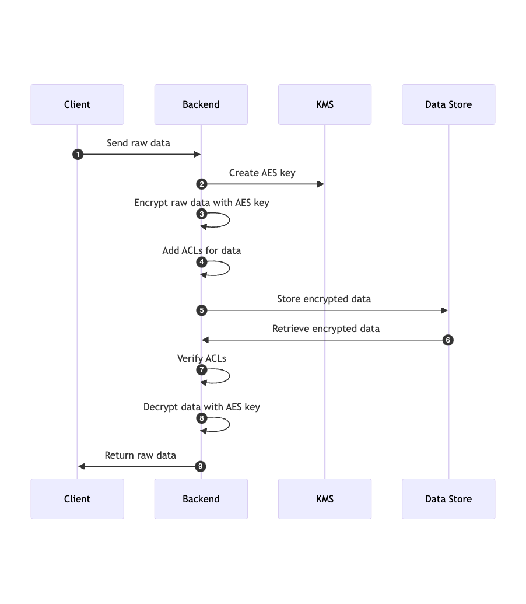
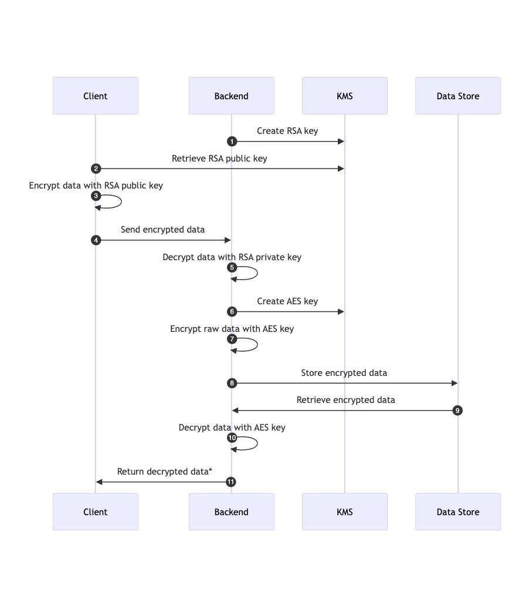
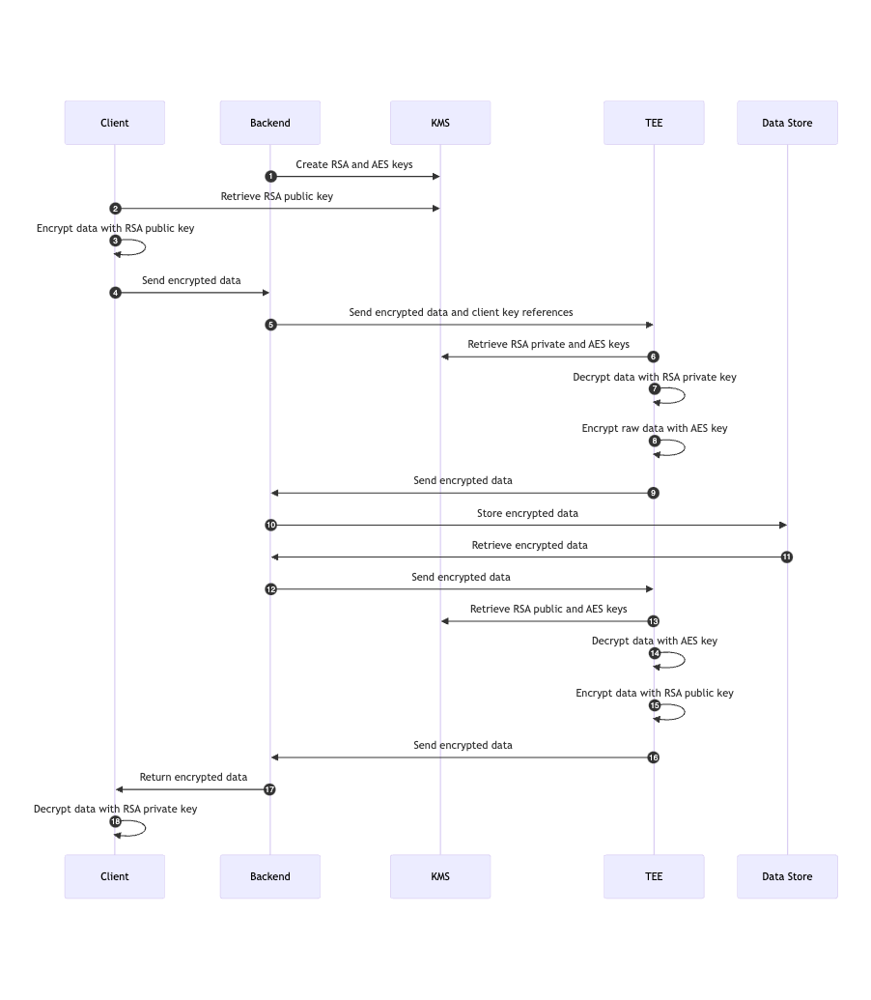

[Keyper](https://github.com/jarrid-xyz/keyper) is a powerful multi-platform Kotlin (Java) based CLI tool designed to simplify crypto key management, deployment, and now, data management. Check out [Keyper Data CLI](https://jarrid.xyz/keyper/data/) to encrypt and decrypt data with a single command.

We are excited to share we've launched [Keyper's](https://github.com/jarrid-xyz/keyper) documentation site: [jarrid.xyz/keyper](https://jarrid.xyz/keyper). You can also check Keyper's [latest release notes](https://github.com/jarrid-xyz/keyper/releases/tag/v0.0.0) and [roadmap](https://github.com/orgs/jarrid-xyz/projects/1/views/3) on our [Github](https://github.com/jarrid-xyz).

## Introduce Keyper Secure Data Flow

Today, the public internet is protected by protocols like [TLS](https://jarrid.xyz/keyper/data/terminology/#example-tls-transport-layer-security) to ensure secure data transmission. We've propose three levels of data security protocols to standardize how data should be handled between clients, platform backends, and data storages.

1. **[Direct AES + ACLs Encryption Flow](https://jarrid.xyz/keyper/data/secure-data-flow/#direct-aes-acls-encryption-flow)** 
   
    This approach uses AES encryption for data security and IAM solutions for access control. It is simple and efficient, ideal for use cases such as internal data management.

    

2. **[Hybrid RSA + AES Encryption Flow](https://jarrid.xyz/keyper/data/secure-data-flow/#hybrid-rsa-aes-encryption-flow)**
   
   This approach uses RSA for initial encryption and AES for data storage. It provides added security by ensuring that raw data is not sent to the backend directly, making it ideal for transmitting sensitive data like credit card numbers or social security numbers.

   

3. **[AES + RSA + TEE Encryption Flow](https://jarrid.xyz/keyper/data/secure-data-flow/#aes-rsa-tee-encryption-flow)**
   
   Combining RSA and AES encryption with a [Trusted Execution Environment (TEE)](https://jarrid.xyz/keyper/data/terminology/#tee-trusted-execution-environment), this approach offers the highest security by ensuring that the backend never has access to raw data or AES keys. It is suitable for highly regulated industries for data protection such as government and defense.

    

Our plan for this week is to release [Direct AES + ACLs Encryption Flow](https://jarrid.xyz/keyper/data/secure-data-flow/#direct-aes-acls-encryption-flow) and [Hybrid RSA + AES Encryption Flow](https://jarrid.xyz/keyper/data/secure-data-flow/#hybrid-rsa-aes-encryption-flow) to showcase how Keyper can streamline the deployment of crypto keys and easily integrate with existing client and backend data handling code.

::LetsTalkAndSubscribe{ctaText="Trying to improve data security implementation to your internal data infrastructure? We'd love to help. Talk to us now."}
::

## Roadmap

### Make AES + RSA + TEE Encryption Flow Accessible

We are on track to implement end-to-end encryption with a streamlined [TEE](https://jarrid.xyz/keyper/data/terminology/#tee-trusted-execution-environment) environment. [Apple has recently made an announcement to make privacy compute easily accessible to its users](https://www.apple.com/newsroom/2024/06/apple-extends-its-privacy-leadership-with-new-updates-across-its-platforms/). While this is a very exciting development, Apple did not explain exactly how users can have clear control and visibility over what data is being shared and how they can revoke it.

Our goal is to bring [TEE](https://jarrid.xyz/keyper/data/terminology/#tee-trusted-execution-environment) compute to developers and companies of all sizes, enabling anyone to implement the highest levels of security and privacy, ensuring data confidentiality with ease.

### Managed Vault with Homomorphic Keys

Get ready for an industry first! We are introducing a managed vault as a service that will support cutting-edge cryptographic technologies, including homomorphic keys. Our goal is to make adding advanced cryptographic key encryption to any tech stack as simple as possible. This innovation will enable secure and privacy-preserving analytics and AI/ML use cases, revolutionizing how sensitive data is handled and analyzed.

Stay tuned for these exciting updates and more as we continue to enhance [Keyper’s](https://github.com/jarrid-xyz/keyper) capabilities!

## Industry News Update

This week, [Snowflake data breach continues to impact all major companies](https://www.cnbc.com/2024/07/12/snowflake-shares-slip-after-att-says-hackers-accessed-data.html).

While it's challenging to determine precisely what could have prevented the breach, implementing an additional layer like the [Direct AES + ACLs Encryption Flow](https://jarrid.xyz/keyper/data/secure-data-flow/#direct-aes-acls-encryption-flow) could have mitigated the risk by preventing unauthorized access to raw data.
