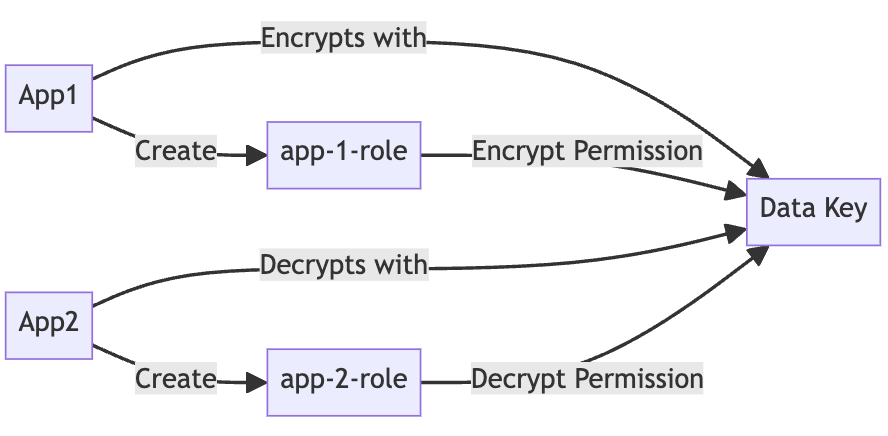

We are thrilled to share the release of [Keyper v0.0.1](https://github.com/jarrid-xyz/keyper/releases/tag/v0.0.1){:target=_blank}, packed with new features to simplify your IAM role management and enhance your data encryption workflows. This release introduces the ability to add IAM roles, configure encryption and decryption permissions, and automate the deployment of permission policies to Cloud KMS and IAM. These improvements pave the way for the [Direct AES + ACLs Encryption Flow](https://jarrid.xyz/keyper/data/secure-data-flow/#direct-aes-acls-encryption-flow){:target=_blank} we have discussed in [Jarrid's Secure Data Flow architecture](2024-07-14-introduce-keyper-secure-data-flow).

## New Features in [Keyper v0.0.1](https://github.com/jarrid-xyz/keyper/releases/tag/v0.0.1){:target=_blank}

1. Ability to Add IAM Roles
   
   You can now create IAM roles using [Keyper](https://github.com/jarrid-xyz/keyper). This feature simplifies the process of role management, ensuring your applications have the necessary permissions without the usual complexity.
2. Encryption and Decryption Permissions
   
   Assigning encryption and decryption permissions to your IAM roles. With this update, you can add IAM roles to the allow list, granting them the ability to encrypt and decrypt data keys.
3. Automated Permission Policy Deployment
   
   [Keyper](https://github.com/jarrid-xyz/keyper) automatically deploys permission policies to Cloud KMS and IAM. This automation reduces the manual overhead and ensures your policies are correctly configured and applied.

## Direct AES + ACLs Encryption Flow

This release enables the [Direct AES + ACLs Encryption Flow](https://jarrid.xyz/keyper/data/secure-data-flow/#direct-aes-acls-encryption-flow){:target=_blank}, a simple but much more secure mechanism for common data handling.



## Real-World Use Case

1. **App1**
   
   A backend application responsible for collecting data. This application will create a role (`app1-role`) and be granted encryption permissions for the data key.
2. **App2**
   
   A Spark application designed for data processing or analysis. This application will create a role (`app2-role`) and be granted decryption permissions for the data key.

### Workflow

1. **Create IAM Roles**:
    ```shell
    keyper resource create -t app1-role
    keyper resource create -t app2-role
    ```

2. **Assign Encryption and Decryption Permissions**:
    ```shell
    keyper resource key -k <key-id> -o ADD_ALLOW_ENCRYPT -r app1-role
    keyper resource key -k <key-id> -o ADD_ALLOW_DECRYPT -r app2-role
    ```

This will generate a key configuration file:

```json
#!/config/<deployment>/key/<key-id>.json

{
    "base": {
        "created": "<timestamp>",
        "updated": "<timestamp>",
        "id": "<key-id>",
    },
    "type": "KEY",
    "ttl": 7,
    "rotationPeriod": "7776000s",
    "permission": {
        "allowEncrypt": [
            "app1-role"
        ],
        "allowDecrypt": [
            "app2-role"
        ]
    }
}
```

3. Deploy


```bash
keyper deploy plan
keyper deploy apply
```

## Demo

### Key and Role Creation + Permissions

::Asciinema{id="asciicast-669493"}
::

### Deploy

::Asciinema{id="asciicast-669496"}
::

## Roadmap

We continue to be on track to make the following features available:

* **Make AES + RSA + TEE Encryption Flow Accessible**: Implement end-to-end encryption with a streamlined TEE environment, bringing TEE compute to developers and companies of all sizes for enhanced data security and privacy.
* **Managed Vault with Homomorphic Keys**: Introducing a managed vault service supporting advanced cryptographic technologies, including homomorphic keys, enabling secure and privacy-preserving analytics and AI/ML use cases.

Stay tuned for these exciting updates and more as we continue to enhance [Keyper](https://github.com/jarrid-xyz/keyper) capabilities!


## Summary

With the release of [Keyper v0.0.1](https://github.com/jarrid-xyz/keyper/releases/tag/v0.0.1){:target=_blank}, [Keyper](https://github.com/jarrid-xyz/keyper) can significantly simplify and consolidate IAM roles and crypto key encryption policies management. By automating the deployment of permission policies and enhancing the role configuration process, you can now achieve secure data encryption and decryption with minimal effort. Get started today and experience streamlined security management for your applications.

For detailed instructions and further examples, please refer to our updated documentation [here](https://jarrid.xyz/keyper/resource/key/){:target=_blank}.

::LetsTalkAndSubscribe{ctaText="Trying to improve data security implementation to your internal data infrastructure? We'd love to help. Talk to us now."}
::

