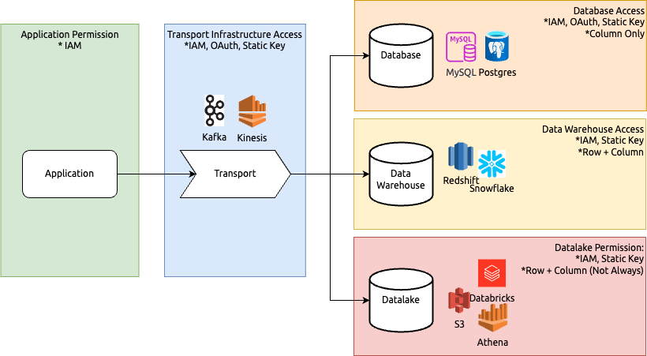

Product and infrastructure engineering teams are not always aligned with the interests of security engineering teams. While product and infrastructure focus on driving business value and delivering practical solutions, security focuses on detection, prevention, and remediation, which can seem less immediately valuable. Like an insurance policy, it's not entirely obvious why it's worth the money or effort when there hasn't been an incident yet. Instead of the traditional cycle of identifying vulnerabilities, applying remediation, and following up through case management, I've found it much more effective to advocate for security solutions that also deliver business value. For example, using OAuth and IAM-based access instead of static keys and encryption instead of more granular access control can significantly simplify infrastructure, reduce complexity, and lessen the operational burden, making them very appealing to both product and platform engineering teams.

## An Example: Replace Static Keys with IAM-Based OAuth

Traditionally, access between systems is implemented via static key-secret pairs. While common, this method often leads to reliability issues due to the complexity of managing key generation, rotation, and application lifecycle. Platform teams must also invest significant effort in monitoring and detecting anomalies to prevent unexpected key-secret compromises, such as accidental exposure via Slack or GitHub. Even when developers report and remediate leaks, the rotation process can be laborious. Worse, developers may consider it a low-risk leak, and the leak can go unreported.

According to [ISO/IEC 27001:2022, A.9.1](https://www.iso.org/standard/54534.html){:target="_blank"}

> Organizations must implement policies and procedures to control access to information, ensuring it is only accessible to those with a legitimate need

Platform teams have two choices: 

1. Add more complex access controls and approval processes.
2. Replace static key-secret pairs with IAM-based OAuth.

The first option can be tempting, as it involves simply adding a vendor like [ServiceNow](https://www.servicenow.com/){:target="_blank"} without much additional work. However, the second option, while requiring more implementation changes, is more secure and reduces the operational burden on application teams to update secrets, restart pods, and ensure secrets are picked up. In fact, several companies focusing on non-human identity authentication, such as [P0](https://www.p0security.com/){:target="_blank"} and [Clutch](https://www.clutch.security/){:target="_blank"}, have recently emerged, highlighting the growing trend towards more secure and efficient authentication methods.

This example demonstrates how a different approach to security implementation can improve security standards, simplify infrastructure architecture, and enhance overall developer velocity.

## The Case for Data Encryption

Data encryption is another example where, although security teams cannot simply "add a vendor" (we'd like to be that vendor one day), it significantly reduces complexity and implementation efforts across all platforms from both security and architecture design standpoints.

The typical data flow involves:
- Source application publishes data
- Data is sent to a transport layer (e.g., Kafka, Kinesis)
- Data is stored in a database (MySQL, Postgres), data warehouse (Redshift, Snowflake), or data lake (S3, Databricks)

Different solutions have different interpretations and implementations of "access control," leading platform teams to implement their own versions. This often results in fragmented implementations across the company. For security engineers, the more fragmented the implementations are, the more difficult it is to implement standardized governance, control, and monitoring, ultimately making the system less secure.

### Infrastructure/Vendor Auth and Permission Comparison 

| Platform   | IAM-Based Auth                                                                                                                                  | Row/Column Permissions                                                                                                                                                                                                  |
| ---------- | ------------------------------------------------------------------------------------------------------------------------------------------------------ | ----------------------------------------------------------------------------------------------------------------------------------------------------------------------------------------------------------------------- |
| Databricks | Supports IAM-based permissions [Link](https://docs.databricks.com/en/admin/account-settings-e2/credentials.html){:target="_blank"}                  | Supports row and column-level security [Link](https://docs.databricks.com/en/tables/row-and-column-filters.html#filter-sensitive-table-data-using-row-filters-and-column-masks){:target="_blank"}                    |
| Snowflake  | Does not natively support IAM-based permissions [Link](https://docs.snowflake.com/en/user-guide/admin-security-fed-auth-use.html){:target="_blank"} | Supports [row](https://docs.snowflake.com/en/user-guide/security-row-intro){:target="_blank"} and [column-level](https://docs.snowflake.com/en/user-guide/security-column-intro){:target="_blank"} security             |
| MySQL      | Does not support IAM-based permissions                                                                                                                 | Supports row and column-level security through grants and policies [Link](https://dev.mysql.com/doc/refman/8.0/en/privileges-provided.html){:target="_blank"}                                                        |
| PostgreSQL | Does not support IAM-based permissions [Link](https://www.postgresql.org/docs/current/auth-pg-hba-conf.html){:target="_blank"}                      | Supports [row](https://www.postgresql.org/docs/current/ddl-rowsecurity.html){:target="_blank"} and [column-level](https://www.postgresql.org/docs/current/infoschema-column-privileges.html){:target="_blank"} security |

With data encryption, access is configured once with a crypto key and can then be assigned to individual workloads at different stages of the data flow. This significantly reduces the complexities involved in implementing and aligning permission policies across different platforms. Encryption ensures that data is consistently protected across all platforms, simplifying governance and control while enhancing overall security.

::LetsTalkAndSubscribe{ctaText="Trying to improve data security implementation in your internal data infrastructure? We'd love to help. Talk to us now."}
::

## Let Keyper Up Your Data Encryption Game

[Keyper by Jarrid](https://jarrid.xyz/keyper){:target="_blank"} empowers engineering teams to embed data encryption in any data handling process to streamline security implementation. Keyper offers a suite of crypto key management APIs designed to simplify key creation, management, deployment, and encryption/decryption. By integrating with cloud KMS services like AWS KMS and GCP KMS, Keyper enables managed crypto key generation, reducing infrastructure maintenance. This allows organizations to configure encryption once and apply it consistently across all stages of the data flow, ensuring robust security while simplifying governance and operational processes.

::LetsTalkAndSubscribe{ctaText="Trying to improve data security implementation in your internal data infrastructure? We'd love to help. Talk to us now."}
::
