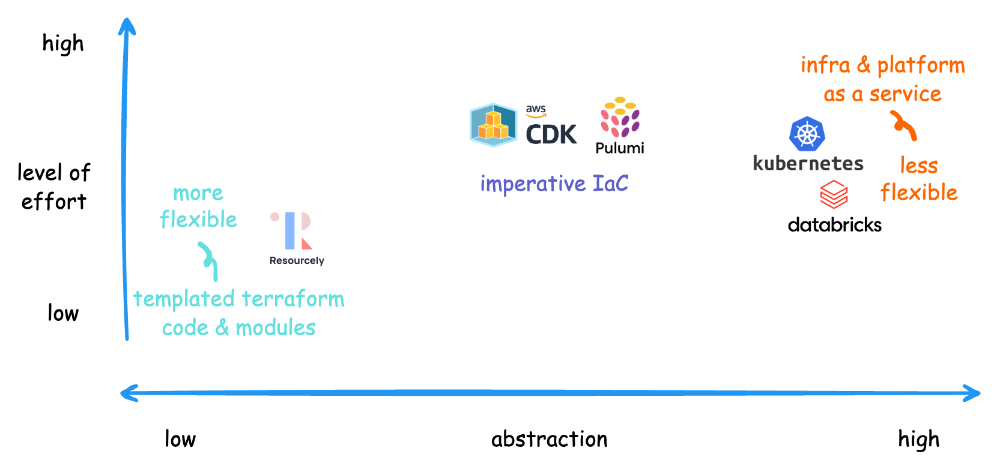

Infrastructure as code (IaC) has become increasingly challenging as organization and usage scale. Inconsistent configurations, security gaps, increasing costs remain to be hard to manage without the right level of abstraction, but what's the right level of abstraction?

## From DevOps to Infrastructure as Code

DevOps started with engineers clicking around the AWS console and writing scripts to automate tasks like creating EC2 instances and setting up VPCs, but as usage grew, Infrastructure as Code (IaC) tools such as terraform and CloudFormation emerged. Instead of writing shell scripts, infrastructure engineers can write declarative code to define how the cloud resources should be deployed. This is a great step up in terms of abstraction from the one-off automation scripts. On one hand, the declarative nature of the IaC tools makes it easy enough for most developers to write (you can think of it as configuration instead of code); on the other, it's not **abstracted** enough to give platform engineers the ability to write modularized code for developers to create infrastructure across the organization.

Take resource tagging for example, for both cost tracking and governance purposes, it's a very common use case to want to tag cloud resources by application, team, business unit, cost center etc. With terraform, application engineers need to manually specify these tags for each resource. Even if platform engineering teams create the relevant terraform "tag" module to enforce common fields, application engineers still need to provide the tag values every time. The declarative nature of IaC makes it hard for platform engineering teams to automatically populate these tag values from a central registry of applications and teams. This becomes especially problematic as the number of resources and size of organization grows.

This led to the next question: how can we create a higher level of abstraction on top of IaC that addresses these enterprise-scale challenges?

## Creating Platform Abstraction for Scale

Creating the right level of platform abstraction enables large organization to manage infrastructure at scale more effectively and increase developer velocity. Platform engineering teams often use a mix of strategies, depending on use cases, resources, and expertise within the organization.

### 1. Terraform Modules or Templates

Creating reusable terraform modules or templates is a common and easy way to create higher-level abstractions. While flexible, it's a lower-level abstraction, making organization-wide changes can be time consuming as they require review and testing by individual application team. For organizations lacking resources and expertise, vendors like [Resourcely](https://www.resourcely.io/) create templated terraform code with enforced practice and security.

### 2. Imperative IaC

With declarative IaC, integrating external processes into infrastructure deployment often requires workarounds. Platform teams frequently combine declarative IaC with one-off scripts or API calls in their CI/CD pipelines. Tools like AWS CDK (Cloud Development Kit), TF CDK, and Pulumi allow teams to generate IaC using imperative programming languages, enabling platform engineers to create infrastructure code alongside dynamic processes. While this provides greater flexibility and abstraction, it poses a higher adoption barrier for application teams less familiar with these "CDK" frameworks.

### 3. Infrastructure and Platform as a Service

At the highest abstraction level, platforms like Databricks, Confluent, and Elastic wrap entire infrastructure deployments, exposing only relevant configurations to developers. This allows provisioning of complex, distributed systems with minimal effort. Kubernetes similarly abstracts compute resource management, enabling developers to create deployments using high-level configurations.

While the high level abstraction allows platform teams to standardize provisioning, governance, and security at scale for supported use cases, it comes at the cost of reduced flexibility and potential vendor lock-in. New or custom use cases can require much longer implementation cycles.

## Platform Abstraction: Balancing Flexibility and Control

Defining the "right" level of abstraction is never easy. Too little abstraction can lead to frequent manual updates and migrations, inconsistent standards, security and governance implementations. However, too much abstraction can force teams to adapt their use cases to fit the platform's limitations, slowing down developer velocity.

The ideal abstraction varies case by case. For real-time fraud detection or experimental features, teams often need flexibility. Templated terraform might provide sufficient guardrails while enabling developers to easily create custom deployments.

In contrast, common use cases like data streaming involving Kafka, connectors, and multi-platform integrations typically require more abstraction. Platform teams often create end-to-end deployments, exposing only necessary configs. However, data pipelines can be nuanced, platform teams often expose lower-level components, allowing application teams to create custom implementation easily and bring back these features to the platform as they mature.

For less complicated scenarios like application deployment, most teams only need to specify a Docker image, CPU, and memory requirements. Platform teams can wrap the CI/CD process without exposing lower-level components.

Knowing the different implementation strategies and levels of abstraction for various scenarios, how can we build platforms that scale?

## Future of Platform Engineering

### Data and AI Platform as a Service

Kubernetes has simplified infrastructure and application deployment, but data platforms have become increasingly complex. The proliferation of specialized data tools, compounded by AI and ML solutions, has made standardization, integration, security, and governance much harder to manage than infrastructure or application deployment.

Vendors like Confluent, Snowflake, Databricks, and dbt are improving the developer experience with more automation and integrations, but they often operate independently. This fragmentation makes standardizing multi-directional integrations across identity and access management, data governance, security, and cost control even more challenging. Developing a standardized, secure, and scalable solution for multi-platform environments is now a fast evolving area for platform engineering teams.

### Higher Abstraction for Standardization, Security and Governance

While application developers can use low-level terraform to create infrastructure on their own, this approach doesn’t scale at the enterprise level. Standardization, security, governance, and cost efficiency aren't just “nice to have” but "required" for large organizations. Many companies undertake multi-year, large-scale migrations due to a lack of abstraction where it’s needed, meanwhile slowing down developer velocity in areas where abstraction isn’t necessary.

Developers are looking for a combination of flexibility and simplicity depending on the features they are trying to build. Platform teams must continue to simplify the developer experience while strategically exposing lower-level components where necessary. By exposing the right components, they provide developers with greater flexibility and reduce the time needed to integrate new features back into the platform.

### Imperative IaC for Platform Teams

To enable platform teams to build for higher abstraction and flexibility, offload the complexity from CI/CD pipelines, which are designed for orchestration rather than abstraction. Currently, platform teams typically use either configuration-driven systems or declarative IaC, but both approaches have limitations when it comes to creating sophisticated, dynamic deployments and abstraction.

The gap in tooling continues to be a challenge, especially for data and AI platform engineering. While there's a proliferation of data product vendors, few focus on simplifying multi-platform deployments. Instead, there's a surge of governance, lineage, and cataloging products to compensate for the lack of integrations. These solutions aim to solve the complexity that arises from using multiple platforms without addressing the core issue of creating streamlined and flexible deployments across data and AI products and platforms.

While infrastructure development tools and frameworks is a highly competitive space, there's still room for tools that can provide the advantage of imperative programming for complex logic, while preserving the audit trails, version control of declarative IaC for governance and compliance.

## Summary

The value of platform engineering is often less tangible than customer-facing product features. While platform improvements may not directly contribute top-line growth, they are one of the most effective ways to manage cloud costs, which is often one of the biggest drivers of bottom-line costs. Choosing the right toolings and abstraction levels can not only improves developer experience and productivity but also strengthen security, governance, and compliance across the organization.