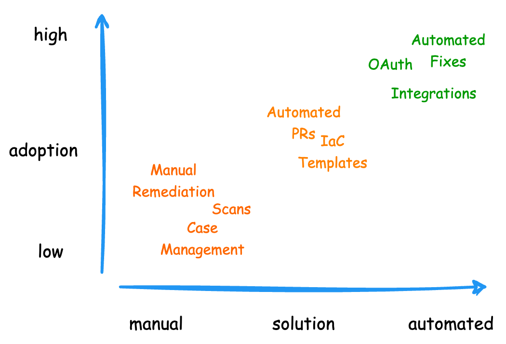
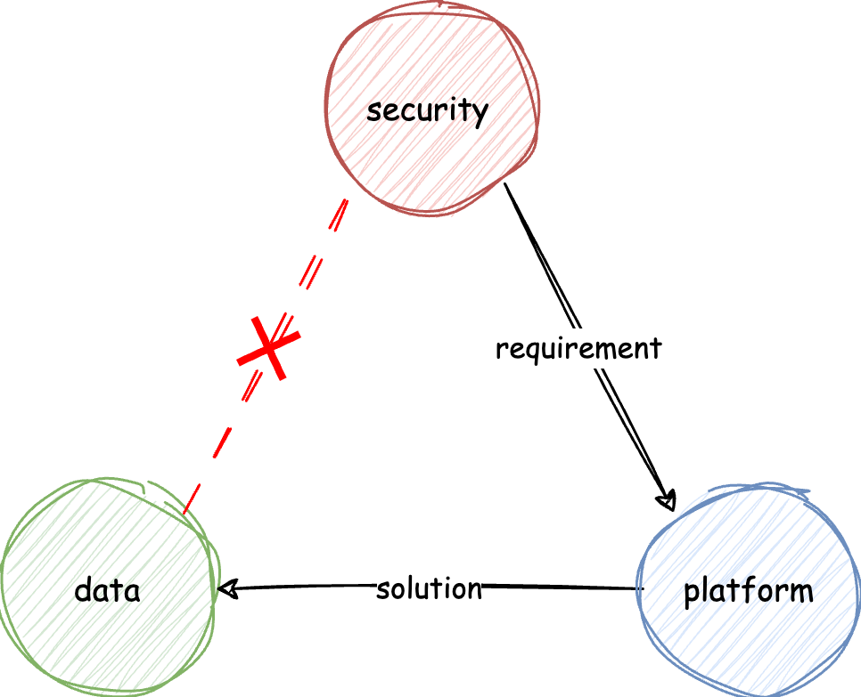

Despite more and more money spent on data security, data breaches continue to occur. Security, platform, and data engineering teams often operate with differing priorities, leading to fragmented solutions that address symptoms rather than the root causes. While there are many exciting new products in developer tools in cloud and app security with varying levels of success, there are currently no similar tools to empower engineers specifically in data security. 

## Lessons Security Teams Can Learn from Platform Engineering

Security teams often face similar challenges as platform engineering. Both frequently propose changes that, while critical for long-term success, don't offer immediate value to developers and worse, lead to lengthy migrations. Platform engineering work like infrastructure consolidation or standardization, while helping developers move faster in large organizations, often lacks obvious benefits for individual teams.

To drive adoption for "unpopular" changes, platform teams commonly use "carrot and stick" approaches. In my career, I've learned that rolling out platform changes alongside features that make developers' lives easier is far more effective than mandates. For example, instead of repeatedly asking (or spamming) teams to annotate their applications with infrastructure tags, automatically creating integrations such as permission policies to access secrets based off the annotations can improve both adoption and the accuracy of the annotations much more effectively.

Security engineering shares many similarities with platform engineering. Platform engineering teams are accustomed to building self-serve developer tools and automation to reduce their support and ops burden. Today, many security teams focus on creating scans, dashboards, scores, and pinging teams to address vulnerabilities—an approach proven ineffective and overwhelming for application teams. Instead, identifying creative solutions that simplify developers' work while strengthening security implementations could drive much better adoption.

## Fragmented Data Security

Despite cybersecurity insurance premium and spending on security solutions continue to increase, data breach remains to be problematic and continue to grow both in number of incidents and scale. Data security requires a combination of expertise from platform engineering, data engineering, and security. The reality is that most organization either can't afford to have in-house expertise for all three disciplines, even when they do, allocating resources to develop automated data security solutions is often not a business priority.

Today, data security implementation is shared across these three teams, often resulting in fragmented and ineffective solutions. Security teams define requirements for platform teams. Platform teams then interpret these requirements (often as simple checkboxes) for data teams. Data developers face inconsistent expectations; some resort to creating their own solutions, which aren't scalable due to lack of coordination and alignment across teams.

## What Data Security Can Learn from App Security

Scanning and remediation aren't new concepts in software security. Take app security for example: tools like SonarQube and CVE scans have existed for more than a decade (yes, we didn't need AI for that). Companies like [Snyk](https://snyk.io/), [Arcjet](https://arcjet.com/), and [GitHub's Dependabot](https://github.com/dependabot) have taken a more developer-centric approach, creating easy-to-use tools that integrate security into the development process. This makes security a natural part of coding.

Data security tools like [Amazon Macie](https://docs.aws.amazon.com/macie/latest/user/what-is-macie.html), [Google Cloud DLP](https://cloud.google.com/security/products/dlp), and platforms like [Wiz](https://www.wiz.io/), [BigID](https://bigid.com/), [Varonis](https://www.varonis.com/), and [Imperva](https://www.imperva.com/) offer scanning capabilities. However, they often lack automated or retroactive remediation, with existing options typically tied to the platform and inaccessible to most developers.

While we know there's an issue and how to fix it, if the work isn't automated, vulnerability remediation hardly makes it to the prioritization board alongside feature work, tech debt, and KLOs. This narrative can change if we give platform engineers the tools and automation they need to address security issues efficiently and proactively.

## Developer Centric Data Security Tools

To effectively address data security issues, developers need tools that not only identify problems but also empower developers to solve them through automation. This allow developers to take a more proactive approach in there development cycle.

Today, many data security platforms run scans against data lakes and infrastructure and flag unencrypted sensitive data stored on S3 bucket. The security analyst then tag the platform engineer to delete the file. The flag keeps coming back as existing data pipelines continue to write sensitive information to the bucket and the real fix is on data engineering teams to properly implement encryption. This often becomes a game of “whack-a-mole” fixes, yet the root remains unaddressed.

We've created [Keyper](https://jarrid.xyz/keyper) to take a new approach to address the gap:

1. Security Aware Data Metadata
   
   Data schema formats such as [Avro](https://avro.apache.org/) and [Json](https://json-schema.org/) currently lack built-in support for data sensitivity or security-aware metadata. Additionally, common formats like Parquet and Iceberg, while efficient for storing large datasets, don’t natively include security-aware metadata. At [Jarrid](https://jarrid.xyz/), we are exploring various metadata formats to incorporate data sensitivity and security-aware attributes that can be easily tracked at the data lake, file, and even down to the field level.

    By tagging security-aware metadata directly into the data schema, tracking encryption keys and enforcing security policies across data pipelines and storage becomes easier. Currently, Keyper makes encryption key permissions configuration-driven and trackable, ensuring that encryption keys and their access rules are well-managed, version-controlled, and easy to audit.

2. Generic Encryption Library
   
   [Keyper](https://jarrid.xyz/keyper) is a generic data-in-use encryption library that can be integrated at various points in the data lifecycle. The library can encrypt and decrypt data in-use across different platforms and use cases such as streaming, batch processing and ci/cd pipelines. With integrations to data platforms such as Kafka, Spark and ci/cd pipelines such [Github Actions](https://github.com/marketplace/actions/keyper-action), developers can implement encryption and decryption as part of the development process.

## Security as Enabler

Enablement is more effective than limitation, and security is no exception. The barrier from reactive to proactive data security is steep, and without the right developer tools and automation, there’s no end in sight to data breaches. The most effective way to make this transition is by giving developers the tools and automation they need to solve security problems as part of their existing workflows, instead of as an afterthought.

Most companies today are overwhelmed by the number of alerts, processes, and compliance requirements they must meet. Innovation from existing engineering teams can be challenging. However, at [Jarrid](https://jarrid.xyz/), we continue to experiment with data security tools that enable data, platform, and security teams to move faster together while staying secure. By automating remediation and embedding security into the development process, we can simplify compliance and help organizations proactively address data vulnerabilities.

## Summary

As we continue to experiment with developer tools that can both mitigate risks and increase developer velocity, we'd love to learn about the data security challenges your developers face and how can continue to build [Keyper](https://jarrid.xyz/keyper) to help organizations transition into proactive data security. 
