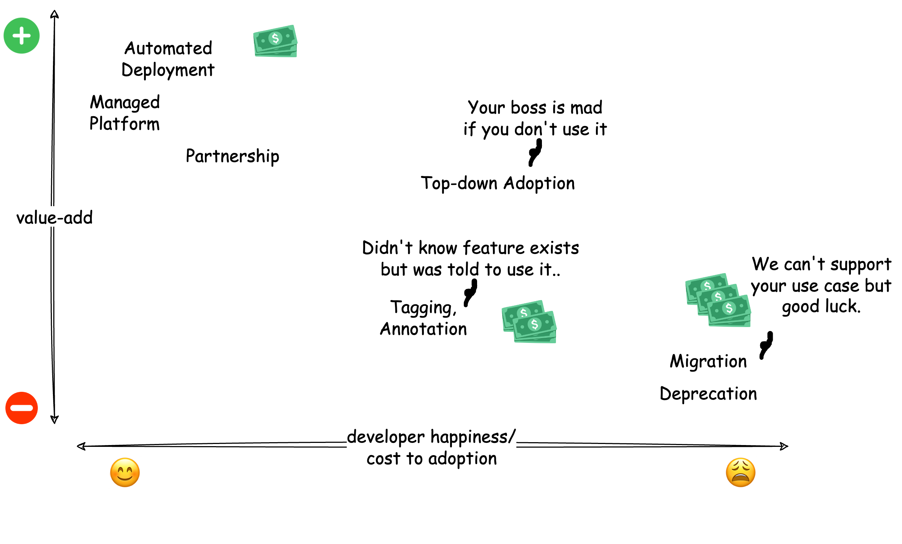

Infrastructure and internal platform adoption don’t typically happen organically. In the best-case scenario, adoption happens through partnerships with product teams to enable feature development or provisioning automation. However, in many cases, particularly in the worst-case scenario, platforms are forcibly “adopted” by product teams through migrations.

To set the stage, migrations are bad. As a platform team, if you have to resort to migrations, especially involves application teams, you have failed. Migrations are not only tedious for both application and platform developers, providing little to no value-add while posing risks to major incidents. Moreover, migrations take up resources from both application and platform teams, pulling them away from core responsibilities and impactful work.

## Platform Adoption Economics

Like any product, platforms are no exception - the easier it is to use and get started, and the more time and work it saves, the more likely developers will use it. Building a platform that makes developers' lives easier and gain organic adoption is usually the best strategy forward. 

However, the moment platform teams need to use "sticks" instead of "carrots" to drive adoption, the cost of adoption starts to grow. The hidden costs, while hard to track explicitly, it's usually reflected in engineering time not doing engineering work, team morale, operational overhead, and the long development cycle to accommodate for forced solutions that don't fit.

### Happy Path

In the ideal scenario, automated deployment and managed platforms streamline workflows, it's usually in the enablement category where developers can save time, focus on product features that matter to them, and improve developer velocity and overall "happiness".

### Partnership

In the partnership model, application teams have to invest time working closely with platform engineers to co-create new features tailored to their needs. While this requires more commitment from application teams, it allows platform teams to better learn about the use case and lead to better implementations.

### Top-Down Adoption

Engineering managers or VPs can mandate the use of specific technologies or platforms. Developers might not necessarily resonate with the decision. In many cases this is the necessary evil for certain design decisions that's hard to show immediate value to individual engineers but have long term value for the organization as a whole. For example, it's probably easier to agree as an organization whether to use mono or multi-repo. However, not every design decision is important enough to be mandated and it can run into the risks of not being thoroughly validated with every use case and make certain use case incredibly challenging to develop or maintain.

### Implicit Features

In some cases, features like tagging or annotation are introduced without much context. Developers may use these features because they were asked to do so but often unsure of their significance or benefits. While these features might enable certain functionalities, the lack of clarity on intentions can lead to inconsistent and confusing implementations over time.

### Migration and Deprecation

One of the more common—and perhaps the most frustrating—scenarios is platform migration or deprecation. Teams are often asked to move from one platform to another or to stop using certain functionalities without replacement or path forward. From application team’s perspective, there is often little to no value added, and meanwhile the migration process can increase operational burden and pose significant risks. Both platform and application teams find themselves pulled away from their core responsibilities to focus on migration work, which may not align with their developer's role or expertise.

Migrations are also costly for organizations, yet they are frequently normalized as “growing pains”. While there are often many good reasons for migration: security concerns, compliance requirements, long (5-10 years of) overdue technical debt, it's one of the most costly ways to gain adoption.

## Platform Engineering's Existential Crisis

Typical product management focuses on creating features that people love and generate revenue for the company. Internal platforms have more nuanced goals. We are building features developers might or might not love while solving organizational problems like productivity, cost, security, and compliance. Success is measured by the absence of problems - reducing the number of incidents, compliance violations, security breaches, operational costs, and ensuring engineering teams can meet their delivery goals. 

Let's say most people operate in good faith and they want to create great internal platforms that can drive organic adoption. While the definition of success can be a little nuanced in platform engineering's case, it's still relatively clear: reduce cost, improve developer velocity, and standardize implementations to reduce complexity around security and compliance. So why do most internal platforms suck and engineering teams, both platform and application teams, are stuck in never-ending migrations? 

Most companies are not specialized in building developer tools or platforms - they have to staff platform teams because they've grown to a size where abstractions and standards become necessary to manage the complexity and meet the business cost, security and compliance needs. While many platform teams might think they are trying to create the best developer experience possible, the reality is, platform team's most important job is to translate these complex business requirements into guardrails so that developers can build software safely without fully understanding the underlying complexity.

Take PCI DSS (Payment Card Industry Data Security Standard) requirements  for example. Application developers might have a rough idea that they shouldn't log credit card number without redaction or encryption, but most won't understand the exact compliance requirements or company policies. Platform team's job isn't to create the most secure or developer friendly platform possible, but to provide shared data handling implementations that help application developers build compliant software with reasonable overhead.

## Case Study: Building a Data Platform

Every business has data. As organizations scale, managing data becomes inevitable. On one hand, data can enable faster and better decision making, reduce operational costs, and drive business growth; on the other, without proper management, it becomes a liability waiting for security breaches, compliance violations to occur. Data management, at its core, is highly technical and requires close coordination between engineering and business teams. Take building business applications for example - when building a hotel booking app, app developers are relatively clear about the features they need to build: search rooms, track reservations, manage availability. However, without coordination between engineering and business teams on data usage, organizations often end up investing enormous engineering resources to retroactively clean, protect, and transform data to derive even basic value from it.

Take user tracking data for example. Many companies start by collecting user activities in their applications thinking they'll need it for analytics. Without clear alignment between business and engineering on what insights are actually needed, companies end up with inconsistent event naming, missing user context, and scattered PII across raw events. Companies then have to allocate significant resources to cleaning data, detecting PII, stitching together user journeys, and building costly data transformation pipelines - just to get the basic insights that could have been easily obtained if teams set clear data requirements during application development phase.

In response, platform teams often over-engineer solutions: building complex data transformation pipelines, implementing PII detection across multiple systems, implementing metadata frameworks and data lineage tracking. It's not to say that the extra work is not valuable, but rather, it could have been solved by a much cheaper and simpler approach: defining clear data requirements.

## Adoption is a Tool not a Goal

Platform engineering is not different from the day to day decision economics, is the benefit worth the adoption cost? Take data documentation for example, while comprehensive documentation is great on paper, how many engineers are actually successful in writing documentation for every system they've created? The reality is, unless the data has strict security or compliance requirements, there's very little value both to the company and the developers to document that data. Top-down mandate can simply be too costly in most cases and automated metadata tagging even if it's inaccurate could be just good enough.

Another example is data and cloud infrastructure migrations. One of the most common reasons is to consolidate and standardize deployment to reduce operational burden and maintenance work, strengthen security, reduce cloud cost. In these cases, the benefit often outweighs the adoption cost of top-down mandate and large scale migration - fragmented infrastructure leads to security vulnerabilities, operational inefficiencies, and rising costs that affect the entire organization. The cost of maintaining different deployment processes, security practices, and infrastructure patterns often justifies a multi-year migration project.

However, there's a fine line between necessary standardization and unnecessary migration. Almost every organization goes through cycles of tooling migrations - switching between different infrastructure management pattern. Platform teams swing between having teams write their own Terraform, using standardized modules, using configuration manifests only, or building fully managed platforms where teams write no infrastructure code at all. Each migration consumes enormous engineering resources from both platform and application teams while the actual value can be marginal.

These cycles happen because platform teams either try to support every possible use case or force everyone into a single pattern. While building massive platforms to handle every edge case can indeed gain greater adoption, take away 50% of platform team's supporting the 1% use case most likely wouldn't make business sense either.

Most companies aren't in the business of building developer platforms - they create platforms to enable their core business functions efficiently and securely. Platform teams should be conscious of their service boundary: if a system is too specialized for platforms to support, it makes more sense for product teams to build custom. If the right level of abstraction is yet to be proven, it could make more sense to automate as much as possible and minimize adoption costs by pushing for organic adoption. Alternatively, when standardization truly adds value - like reducing security risks or operational costs - the business value could outweigh cost of year long migrations.

Finding the right balance between platform abstraction and business value will ultimately determine whether your platform enables or hinders your organization's success.
