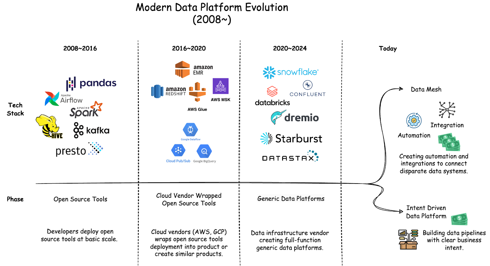

Today, we have access to highly scalable data tools handling massive volumes that would have been unthinkable just a few years ago. LLMs process billions of parameters, streaming platforms handle millions of events per second, and data warehouses that can easily scale to petabytes. Ironically, while individual tools are more scalable than ever, organizations find themselves struggling with increasingly unscalable data platforms.

## Complexity and Cost Spiral

The data platform landscape has rapidly changed in recent years. Teams went from managing open source tools, to cloud vendors offering wrapped solutions, to enterprise-scale data platforms like Snowflake and Databricks that handle ingestion, storage, processing, and analytics. These enterprise data platforms, while powerful, come with significant operation complexity and cost for the organizations.

Today, industry's primary response to the growing complexity and cost of data management is data mesh. Essentially, giving individual teams the autonomy to build their own data systems and create additional automation and integrations to connect these separate systems.

Looking at the general trend, most organizations don’t really struggle from not being able to build data systems fast enough, instead, platform teams aren’t able to sustainably support these separate systems and integrate them. Worse, inconsistent implementation is a management nightmare for security and compliance. These growing complexity, security, and compliance requirements are all major drivers for the growing cost spiral.

## Misaligned Teams

Teams working with data are fundamentally misaligned - app developers are responsible for data collection but their primary focus is customer facing features, data scientists need good data but get burdened with provisioning infrastructure, and platform teams need to optimize costs but can't control how data flows. Today, many vendor solutions try to solve the misalignment problem with data lineage, catalog, quality checks automation. However, these tools focus on analyzing the problem, not solving the problem.

## Patch doesn’t Scale

For most large systems, it's almost always easier and cheaper if you know what you're trying to build ahead of time. Data systems are no exception. Yet most teams approach data publishing with the mindset of "we might need this later" instead of "how will this data be used?" This leads to teams spending more time finding and cleaning data than using it, creating unnecessarily complicated transformation processes, while security and compliance become exponentially more costly. The initial cost of building without clear intent might be lower. However, each new feature and maintenance cost compounds significantly over time.

15 to 20 years ago, when we first had the compute power to process massive amounts of data and businesses were just starting to learn about data's potential, it was understandable that both businesses and engineers didn't yet know how to build data systems. Today, we have many clear patterns and proven use cases across analytics, automation, and operations. Most core business data needs can and should be defined upfront.

## Coming Up Next

In Part 2 of the "One Off to One Data Platform" series, we'll lay out a design framework for data platforms based on common business use cases. By defining data components and time-based requirements per use case, we can systematically derive what a production system needs - from compliance and security controls to infrastructure components to integration capabilities.

With a framework, teams can leverage existing platform components for new use cases instead of bootstrapping infrastructure from scratch each time. This approach not only reduces technical complexity, operational burden, and infrastructure costs, but enables organizations to quickly adapt to evolving business needs.
