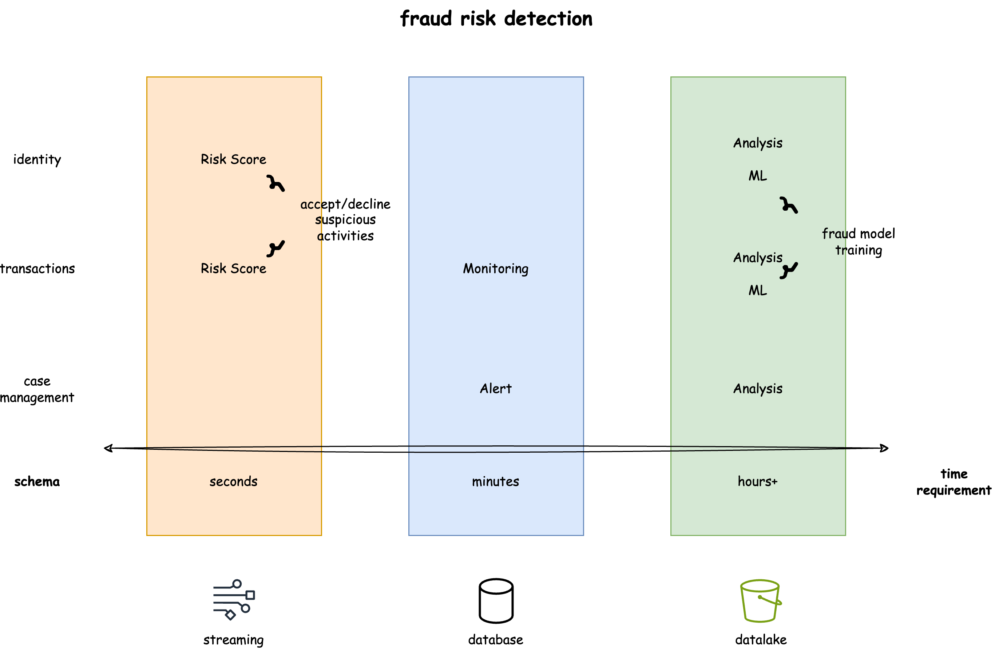
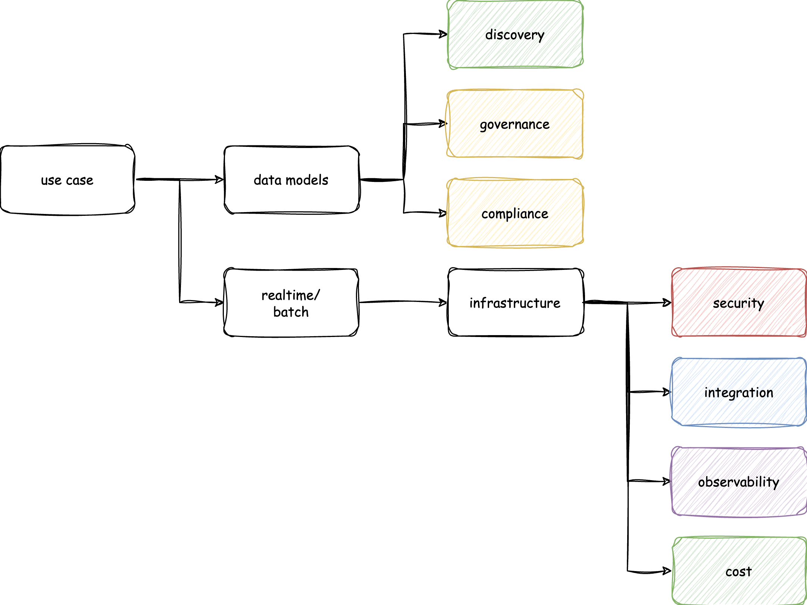

Many data platforms today are built bottom-up, starting with collecting data that "might be useful later" and gradually patching together solutions as needs arise. This approach inevitably leads to fragmented implementation,  mounting cost and technical debt. Data system design requires specialized expertise across data modeling, distributed systems, security, and compliance. Most companies simply cannot afford dedicated data infrastructure teams in their early days and have to build and adapt their data systems as they grow.

However, the path to evolve existing systems can be quite challenging. Teams often have to choose between lengthy migrations while maintaining multiple duplicate systems, or a costly full system cutover. Netscape's decision to rewrite their browser engine in 1997 cost them their browser business and market dominance to Internet Explorer as they couldn't compete with Internet Explorer's rapid feature releases, eventually leading to their decline in market share. Many companies start with custom solutions and migrate to vendor platforms as they grow; however, even at the scale where companies can afford vendor platforms, they may still not fit their use cases and internal users must adapt to new workflows. Many companies end up building custom solutions on top of vendor platforms as they continue to scale. Internal infrastructure teams now have to maintain their original systems, operate vendor platforms, and support custom implementations on top of those platforms - while also training users across different tools and handling security and integrations across multiple systems. Due to lack of planning and organic progress as business scale, what started as a cheaper solution becomes significantly more costly and complex to operate.

Designing data platforms that can scale with business growth is more achievable today than before. Over the past decade, many organizations have established clear data usage patterns - product teams need user behavior data, marketing teams track campaign performance, finance teams monitor revenue metrics, and security teams analyze threat patterns. These common use cases are well-established in terms of what data they need and how quickly they need it. Rather than discovering requirements through costly migrations and retrofitting vendor solutions, it's possible to build a data platform that can sustainably scale in terms of cost and operational efficiency.

## Designing Data Platforms

At its core, a data platform can be defined by two fundamental components: what data you need (data models) and how quickly you need it (latency requirements). Even with a loosely defined use case, understanding these two components allows us to systematically derive data collection mechanism and infrastructure needs. 

Take fraud risk detection for example. Typically, fraud risk requires three data components: identity, transaction and case management.

Each data component can be mapped to infrastructure based on the latency needs. Identity and transaction verification require stream processing for real-time fraud detections, database processing handles ongoing monitoring and alerts, and data lakes to support longer-running tasks like pattern analysis and model training.

### Data Models

A data model defines how data should be organized and standardized. It specifies a set of fields and their characteristics - the format, type, and rules for each field. The schemas enable data discovery, while definitions of individual fields determine governance policies and compliance requirements.

Well-defined data models enable standardized data collection and processing across the organization. Take user data as an example - marketing needs it for campaign tracking, customer service for case management, product teams for behavior analytics, and risk teams for fraud detection. Without a shared user data model, every team builds their own version of user profiles and tracking logic. Teams end up creating complicated integrations to resolve and reconcile user data between systems. A shared data model serving as a single source of truth simplifies data collection and implementation, while consistent standards make security and compliance much easier to manage.

Defining comprehensive data models is often difficult for individual teams as they typically focus on their immediate needs. Marketing teams focus on campaign-related fields, while risk teams focus on identity verification attributes. Without a holistic view of how the same data serves different functions, teams often create incomplete or narrowly-focused data models that require further processing and integrations between systems.

### Time Requirements

Time requirements defines how quickly data needs to be processed and made available. Processing windows range from real-time (seconds) for immediate decisions, to near real-time (minutes) for monitoring, to batch processing (hours) for analytics and AI/ML applications. These time requirements map to specific infrastructure choices - streaming for real-time, databases for near real-time, and data lakes for batch processing.

Without a framework, product teams often build redundant infrastructure for similar needs - one team might use Kafka while another uses MSK for streaming, or one team might choose DynamoDB while another uses Cassandra for databases. This creates unnecessary complexity as teams maintain multiple systems with duplicate security controls and integrations.

By standardizing infrastructure components, product teams no longer need to deploy their own infrastructure, and platform teams can reduce operational overhead by maintaining fewer systems. This standardization also enables better security controls, streamlined integrations, simplified observability, and optimized costs.

## Generic Data Platform

A data platform architecture framework enables us to systematically derive data collection specifications, infrastructure requirements, security controls, and integration capabilities. This directly addresses the complexity and cost spiral that many organizations face today. Rather than teams building separate systems that platform teams struggle to support, a consistent framework simplifies security, compliance, integration, and cost management across the organization.

Without consistent implementation, platform teams are constantly asked to choose between maintaining existing systems, performing costly migrations, or building new features. Platform teams end up spending most of their time maintaining disparate systems and handling migrations instead of delivering business critical capabilities. A framework-driven approach enables organizations to scale their data platforms without disruptive migrations. Smaller organizations can start with necessary components and expand as they grow, and larger organizations can standardize their existing systems once without constant rewrite.

## Coming Up Next

In Part 3 of the "One Off to One Data Platform" series, we'll discuss how this framework can be implemented on a practical level. We'll look into how common data platform components such as streaming, databases, data warehouse, and data lake can be assembled to support different business use cases with consistent security and compliance controls. As organizations grow, this modular approach allows teams to scale individual components independently while maintaining standardized interfaces and controls, eliminating the need for constant migrations. With a clear data platform architecture framework, organizations can build data applications that grow with their business rather than limiting it.
